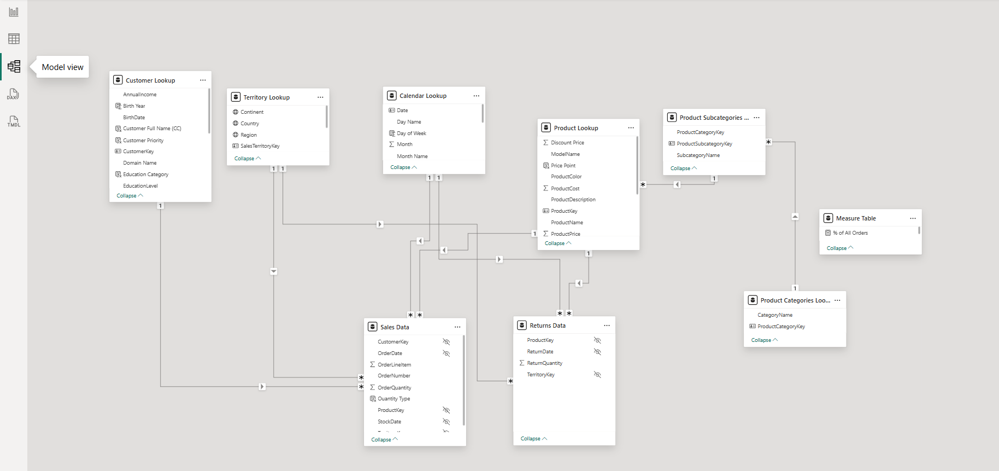

# 🚴 AdventureWorks Sales Analytics Dashboard

A full-cycle Power BI project built on the **AdventureWorks** dataset, covering everything from raw data ingestion to an interactive, multi-page business intelligence report. This project demonstrates end-to-end skills in data transformation, relational modelling, DAX calculations, and professional report design.

---

## 📌 Table of Contents

- [Project Overview](#project-overview)
- [Section 1 — Connecting & Shaping Data](#section-1--connecting--shaping-data)
- [Section 2 — Creating the Data Model](#section-2--creating-the-data-model)
- [Section 3 — Calculated Fields with DAX](#section-3--calculated-fields-with-dax)
- [Section 4 — Visualizing Data with Reports](#section-4--visualizing-data-with-reports)
- [Dashboard Pages](#dashboard-pages)
- [Tools & Technologies](#tools--technologies)

---

## Project Overview

| Metric | Value |
|---|---|
| Total Revenue | $25M |
| Total Profit | $10M |
| Total Orders | 25.2K |
| Return Rate | 2.2% |
| Unique Customers | 17.4K |
| Revenue per Customer | $1,431 |

This project walks through the complete Power BI workflow across **4 major phases**, mirroring a real-world analytics pipeline.

---

## Section 1 — Connecting & Shaping Data

This phase focuses on connecting Power BI to raw source files and transforming them into clean, analysis-ready tables using **Power Query Editor**.

### What was done:

- **Connected** to multiple CSV/Excel source files (Sales, Returns, Products, Customers, Territory, Calendar)
- **Promoted headers** and assigned correct data types to each column
- **Removed duplicates, nulls, and irrelevant columns** to keep queries lean
- **Created conditional columns** (e.g., categorising customers by income level or priority)
- **Merged and appended queries** where needed to consolidate data (e.g., combining regional sales files)
- **Added custom columns** using M language formulas (e.g., extracting year from date, computing age from birth year)
- **Renamed and reorganised** query steps for clarity and maintainability
- Applied **query folding** best practices to push transformation logic back to the source where possible

### Tables loaded into the model:
`Sales Data` | `Returns Data` | `Customer Lookup` | `Product Lookup` | `Product Subcategories` | `Product Categories` | `Territory Lookup` | `Calendar Lookup`

---

## Section 2 — Creating the Data Model

After loading clean tables, a proper **star schema** data model was built in the Model View.

### What was done:

- Designed a **star schema** with two fact tables (`Sales Data`, `Returns Data`) and six dimension/lookup tables
- Created **one-to-many relationships** between lookup and fact tables using primary/foreign key fields:
  - `Calendar Lookup[Date]` → `Sales Data[OrderDate]`
  - `Customer Lookup[CustomerKey]` → `Sales Data[CustomerKey]`
  - `Product Lookup[ProductKey]` → `Sales Data[ProductKey]` and `Returns Data[ProductKey]`
  - `Territory Lookup[SalesTerritoryKey]` → `Sales Data[TerritoryKey]` and `Returns Data[TerritoryKey]`
  - `Product Subcategories[ProductSubcategoryKey]` → `Product Lookup[ProductSubcategoryKey]`
  - `Product Categories[ProductCategoryKey]` → `Product Subcategories[ProductCategoryKey]`
- Set correct **cross-filter directions** (single vs. bi-directional) to control how filters flow
- Created a **dedicated Measure Table** to organise all DAX measures cleanly, separate from raw data tables
- Hid foreign key fields from Report View to keep the field list clean for report authors

### Data Model Diagram:



> Star schema with `Sales Data` and `Returns Data` as fact tables, surrounded by 6 dimension/lookup tables.

---

## Section 3 — Calculated Fields with DAX

DAX (Data Analysis Expressions) was used to build a rich library of calculated columns and measures stored in the **Measure Table**.

### Calculated Columns (added to dimension/fact tables):

```dax
-- Customer Lookup: Full Name with title
Customer Full Name (CC) = [Prefix] & " " & [FirstName] & " " & [LastName]

-- Customer Lookup: Age bucket
Customer Priority = IF([AnnualIncome] > 100000 && [TotalChildren] = 0, "Priority", "Standard")

-- Calendar Lookup: Month-Year label
Month-Year = FORMAT([Date], "MMM YYYY")
```

### Key Measures (in Measure Table):

```dax
-- Total Revenue
Total Revenue = SUMX(Sales_Data, Sales_Data[OrderQuantity] * RELATED(Product_Lookup[ProductPrice]))

-- Total Profit
Total Profit = [Total Revenue] - [Total Cost]

-- Profit Margin
Profit Margin = DIVIDE([Total Profit], [Total Revenue])

-- Return Rate
Return Rate = DIVIDE([Total Returns], [Total Orders], 0)

-- Revenue vs Previous Month
Revenue vs Previous Month = [Total Revenue] - CALCULATE([Total Revenue], DATEADD(Calendar_Lookup[Date], -1, MONTH))

-- Year-to-Date Revenue
YTD Revenue = CALCULATE([Total Revenue], DATESYTD(Calendar_Lookup[Date]))

-- Monthly Revenue (used for KPI cards)
Monthly Revenue = CALCULATE([Total Revenue], DATESMTD(Calendar_Lookup[Date]))

-- 90-Day Rolling Revenue
90-Day Revenue = CALCULATE([Total Revenue], DATESINPERIOD(Calendar_Lookup[Date], MAX(Calendar_Lookup[Date]), -90, DAY))

-- % of All Orders (context-aware)
% of All Orders = DIVIDE([Total Orders], CALCULATE([Total Orders], ALL(Sales_Data)))
```

### DAX Concepts Applied:

- `CALCULATE` with filter context modification
- Time intelligence functions: `DATEADD`, `DATESYTD`, `DATESMTD`, `DATESINPERIOD`
- Iterator functions: `SUMX`, `AVERAGEX`
- `DIVIDE` for safe division (avoids divide-by-zero errors)
- `RELATED` to pull values across relationships
- `ALL` and `ALLSELECTED` for removing/adjusting filter context
- `FORMAT` for display-ready date labels
- `IF`, `SWITCH`, `AND` for conditional logic

---

## Section 4 — Visualizing Data with Reports

The final phase focused on building a polished, interactive multi-page report.

### What was done:

- **Designed 4 report pages**: Dashboard, Map, Product Detail, Customer Detail
- Applied a **consistent dark theme** with teal accent colours matching the AdventureWorks brand
- Built **KPI cards** with previous-period comparisons and trend sparklines
- Used **conditional formatting** to highlight high return rates in red in the product table
- Added **drill-through pages** — clicking a product row navigates to the Product Detail page with full gauge charts and trend analysis
- Configured **slicers and bookmarks** for continent filtering (Europe, North America, Pacific)
- Used **field parameters** and **numeric range slicers** for dynamic filtering
- Designed **gauge visuals** showing monthly performance vs. target for Orders, Revenue, and Profit
- Embedded a **Bing Maps visual** showing sales bubbles sized by order volume per country
- Applied **report-level and page-level filters** to control data scope
- Enabled **cross-filtering** between visuals (clicking a chart filters the rest of the page)

---

## Dashboard Pages

### 1. 📊 Executive Dashboard
High-level KPIs, weekly revenue trend line with forecast, monthly KPI cards, orders-by-category bar chart, and a product performance table with return rate highlighting.


### 2. 🗺️ Map View
Bing Maps visual with bubble markers sized by order volume. Continent slicer buttons (Europe, North America, Pacific) filter the map in real time.


### 3. 📦 Product Detail (Drill-through)
Selected product KPI gauges (Orders vs Target, Revenue vs Target, Profit vs Target), profit trend area chart, and returns trend chart.


### 4. 👥 Customer Detail
Revenue per customer, unique customer count, income-level donut chart, occupation donut chart, top customer spotlight card, and a weekly customers line chart.


---

## Tools & Technologies

| Tool | Purpose |
|---|---|
| Power BI Desktop | Report authoring, data modelling, DAX |
| Power Query (M) | Data connection, transformation, shaping |
| DAX | Calculated columns, measures, KPIs |
| Bing Maps | Geographic visualisation |
| AdventureWorks Dataset | Source data (Sales, Products, Customers, Returns) |

---

## 📁 Project Structure

```
AdventureWorks-PowerBI/
│
├── AdventureWorks_Report.pbix    # Main Power BI file
├── README.md                     # This file
│
├── data/                         # Source CSV files
│   ├── AdventureWorks_Sales_*.csv
│   ├── AdventureWorks_Returns.csv
│   ├── AdventureWorks_Customers.csv
│   ├── AdventureWorks_Products.csv
│   ├── AdventureWorks_Product_Subcategories.csv
│   ├── AdventureWorks_Product_Categories.csv
│   ├── AdventureWorks_Territories.csv
│   └── AdventureWorks_Calendar.csv
│
└── screenshots/
    ├── dashboard.png
    ├── map.png
    ├── product_detail.png
    ├── customer_detail.png
    └── data_model.png
```

---

## 🚀 How to Run

1. Clone or download this repository
2. Open `AdventureWorks_Report.pbix` in **Power BI Desktop**
3. If prompted, update the data source path to point to your local `/data/` folder
4. Click **Refresh** to reload all tables
5. Explore the 4 report pages using the tab navigation at the bottom

---

*Built as part of a structured Power BI learning path covering Sections 3–6: Connecting & Shaping Data, Creating a Data Model, Calculated Fields with DAX, and Visualizing Data with Reports.*

